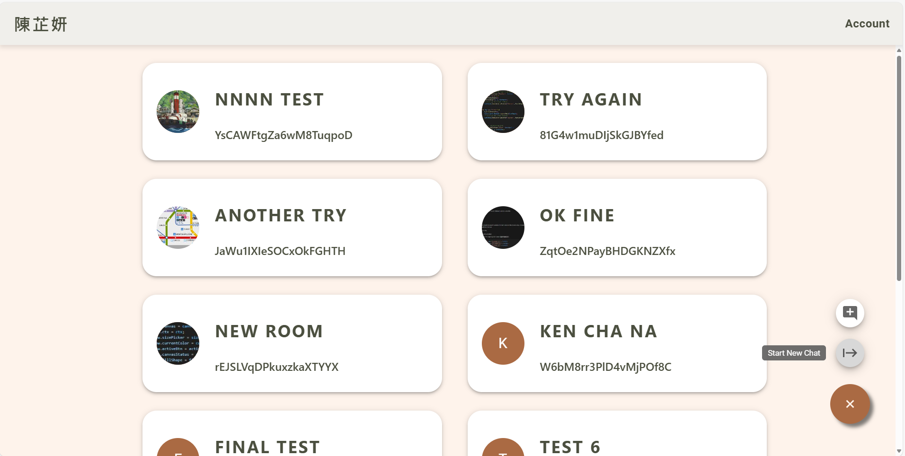
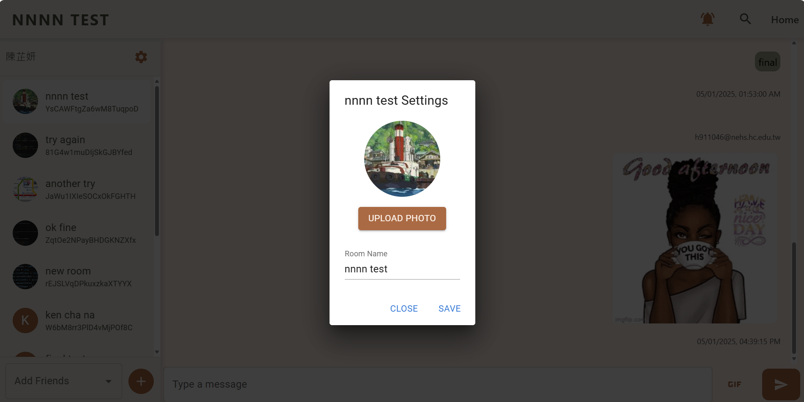
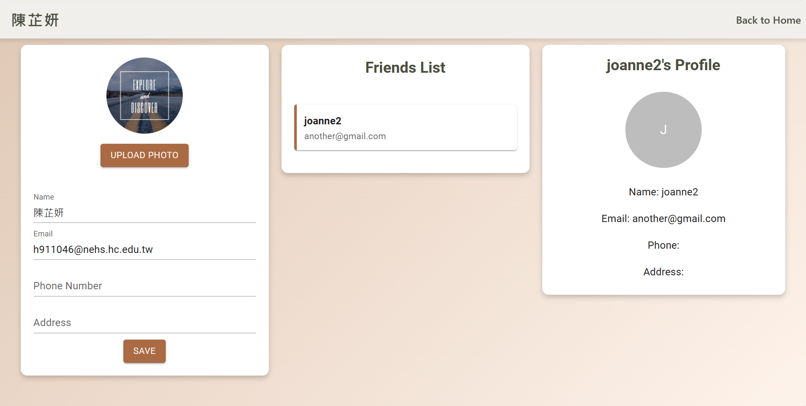
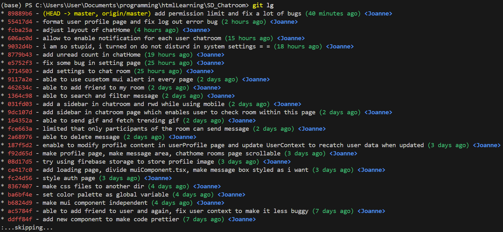

# Software Design Chatroom

## Project Setup

### Using FileZilla

Follow these steps to set up the project locally:
1. Download the Project:
2. Run ```cd Midterm_Project_112062309``` to navigate to the project directory.
3. Run ```npm install``` to install the required dependencies.
4. Run ```npm start``` to start the development server.
5. Open your browser and navigate to `http://localhost:3000` to view the application.

### Using GitHub Repository

Follow these steps to set up the project locally:
1. Clone the repository using the command:
   ```bash
   git clone https://github.com/joanne-09/SD_Chatroom
   ```
2. Navigate to the project directory ```cd SD_Chatroom```.
3. Run ```npm install``` to install the required dependencies.
4. Run ```npm start``` to start the development server.
5. Open your browser and navigate to `http://localhost:3000` to view the application.

## User Manual

1. **Sign Up**: Click on the "Sign Up" button on the Navbar to create a new account or click on the "Get Started" button to sign up with Google Account.
2. **Login**: Click on the "Get Started" button or "Sign In" button on the Navbar to log in.
3. **Create a Chat Room**: Click on the Brown Button on the bottom-right corner of the screen and click on the the "Create Chat Room" button to create a new chat room. Enter the room name and click "Go".

4. **Join a Chat Room**: Click on the Brown Button on the bottom-right corner of the screen and click on the "Join Chat Room" button to join an existing chat room. Enter the room id and click "Go".
5. **Join user Chat Room**: Click on the block in ChatHome page to join the chat room of the user.
6. **Invite a Friend**: Search the email of your friend in the search field located at the bottom-left corner of the chatroom. Click on the Add button to add the friend to the chatroom.
7. **Send a Message**: Type your message in the input box at the bottom of the chat room and click the send button to send it.
8. **Send a GIF**: Click on the GIF button next to the input box to open the GIF search modal. Search for a GIF and click on it to send it in the chat room.
9. **Delete a Message**: Hover over the message you want to delete and click on the trash icon poped up to delete it.
10. **Search Message**: Click on the search icon in the Navbar of the chat room to open the search field. Type your search prompt and the filtered message is showed. Click on the close button to close the search field.
11. **Chatroom Settings**: Click on the Settings button on the Sidebar to open the settings field. You can change the chatroom name and room cover. Click on the Save button to save the changes.

12. **Edit and View Profile**: Navigate to ChatHome page and click on the "Account" button to show menu bar. Click on the "Profile" button to show your profile and your friends. Edit the values of your profile and click on the "Save" button to save the changes. Click on the "Upload Image" button to upload a profile picture.

13. **Check Friend**: Navigate to Profile page and click on a friend to view their profile. Click on the friend again to uncheck them.
14. **Logout**: Click on the "Logout" button after clicking on the "Account" button on the Navbar to log out of your account.

## Basic Features

1. **Membership Mechanism**: 
    - Enable user to sign up and sign in using Google account 
    - Enable user to sign up and sign in using email and password.
    - Support logout functionality.
2. **Host Firebase Page**: Host the project on Firebase.
3. **Database read/write**: 
    - Firestore is used to store user data, chatroom data, and messages.
    - Enable auth user to read and write data to the firestore. 
    - Only room participants can read and write data to the chatroom.
4. **RWD**:
    - Modify ChatHome page to change the layout of chatroom blocks.
    - The Sidebar in Chatroom page is hidden if the screen size is smaller than 600px.
5. **GIT**: Using GitHub to manage and track the project.

6. **Chatroom**:
    - User can create a chatroom and join a chatroom.
    - User can send messages and GIF in the chatroom.
    - Support group chat, adding friends, message search, and unsend messages.

## Advanced Features

1. **React**: Project is built using React and Typescript.
2. **Google Sign In and Sign Out**: Support Google Sign In and Sign Out.
3. **Chrome Notification**: Enable Chrome notification for new messages if user enables the notification of the chatroom.
4. **CSS Animation**: 
    - The wave in Menu page is animated using CSS.
    - Messages are moved from the bottom to the position using CSS animation.
5. **Sending Code**: Messages are sent in code format will not be regarded as code.

## Bonus Features

1. **User Profile Page**: 
    - User can view their profile.
    - User can edit their profile information such as name, email, phone number, and address.
2. **Profile Picture**: 
    - User can upload a profile picture.
    - User can view their profile picture.
3. **Unsend Message**:
    - User can unsend a message by clicking on the trash icon when hover on it.
    - User can only unsend their own messages.
4. **Search Messages**:
    - User can search messages in the chatroom.
    - Click on the search icon in the Navbar to open the search field.
    - Type the search prompt and the filtered message is showed.
    - Click on the close button to close the search field.
5. **Send GIF**:
    - User can send GIF in the chatroom.
    - Click on the GIF button next to the input box to open the GIF search modal.
    - Search for a GIF or use trending GIF and click on it to send it in the chat room.

## Additional Features

1. **Add Friend**: 
    - User can add friend using email.
    - User can view their friends in the profile page.
    - Click on "Add Friend" button under "Account" button to add a friend.
2. **View Friend**:
    - User can view friend list in the profile page.
    - Click on a friend to view their profile.
    - Able to view the friend's profile picture, name, email, phone number, and address.
    - Click on the friend again to uncheck them.
3. **Custom Alert**: 
    - Using Mui Component to show beautiful alert.
4. **Auto Scroll to Bottom**:
    - The chatroom will auto scroll to the bottom when entering a room.
5. **Allow Notification**: 
    - User can allow notification for their chatroom.
    - Click on the Notification button on the Navbar to enable notification after the button is turned Orange.
    - Click on the Notification button again to disable notification after the button is turned Grey.
6. **Chatroom Settings**:
    - User can change chatroom settings in chatroom page.
    - Click on the Settings button on the Sidebar to open the settings field.
    - User can change the chatroom name and roomcover.
    - Click on the Save button to save the changes.